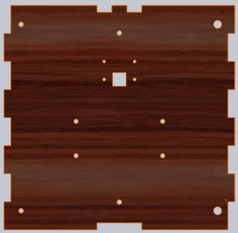
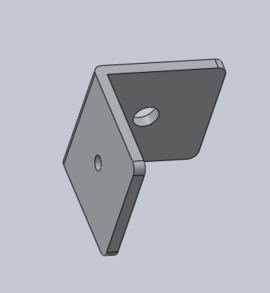
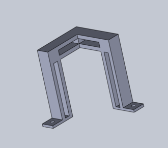
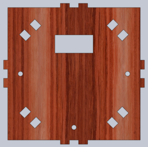
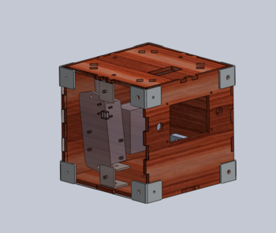

# Introduction
This is the wiki page of the SSA 2017 project group. SSA, or Super Space Adventure, is a subgroup of the BACON club at Charlottesville High School involving attaching a payload to a weather balloon of helium and releasing it. This year, the final decision was to take a large number of pictures and gather as much data as possible on the flight. To accomplish this, we largely relied on the Raspberry Pi computers, because they are portable and can be used to control sensors of all sorts.

# Code
## Arduino
### Arduino Data Transfer

This code paired with the code below allows the Arduino to send data to the Pi

```c
char dataString[50] = {0};
int a =0; 

void setup() {
  Serial.begin(9600);              //Starting serial communication
}
  
void loop() {
    a++;                          // a value increase every loop
    sprintf(dataString,"%02X",a); // convert a value to hexa 
    Serial.println(dataString);   // send the data
    delay(1000);                  // give the loop some break
}
```

## Python
### Python Receiver code

This code paired with the code below above allows the Arduino to send data to the Pi

```python
import serial

ser = serial.Serial('/dev/ttyACM0',9600)    # Tell the Pi where to find the Arduino data
s = [0]
while True:
    read_serial=ser.readline()              # Read a line from the arduino
    s[0] = str(int (ser.readline(),16))     # Convert from hex to ascii
    print(s[0])                             # Print converted data
    print(read_serial)                      # Print actual data
```

### Time Lapse With Pi Camera

This program takes a photo labeled with the time and date it was taken and saves it to the directory /home/pi/Pictures.

```python
import time
from picamera import PiCamera
import os

os.chdir("/home/pi/Pictures") #Change directory to Pictures
camera = PiCamera() #Initialize camera
camera.start_preview()
localTime = time.asctime(time.localtime(time.time())) #Sets localtime to be the current time and date as a string
camera.capture('%s.jpg' % localTime) #For just time and not date use localTime[11:20]
os.chdir("/home/pi") #Change directory
```

### Using Adafruit BMP Pressure Sensor

This program finds and logs data from the BMP Pressure sensor and requires the Python library Adafruit_BMP. You can download this library <span class="plainlinks">[https://drive.google.com/open?id=0B-dpgstk0ZJhYUFvOThIcTNZaFk here]</span>.

```python
import Adafruit_BMP.BMP085 as BMP085
sensor = BMP085.BMP085()
import time
import os

f = open('/home/pi/SSA/SSADataLogs/pressureData.txt', 'a') #Opens the file pressureData.txt in 'a'ppending mode as object f

localtime = time.asctime(time.localtime(time.time())) #Sets localtime to be the current time and date as a string
f.write(localtime[11:20]) #Appends just the time to file f for each data logging
f.write(":\n")
f.write('Temp = {0:0.2f} *C'.format(sensor.read_temperature())) #Writes data to file f
f.write("\n")
f.write('Pressure = {0:0.2f} Pa'.format(sensor.read_pressure())) #Writes data to file f
f.write("\n")
f.write('Altitude = {0:0.2f} m'.format(sensor.read_altitude())) #Writes data to file f
f.write("\n")
f.write('Sealevel Pressure = {0:0.2f} Pa'.format(sensor.read_sealevel_pressure())) #Writes data to file f
f.write("\n")
f.write("---------------------------------------------------------")
f.write("\n")
f.close() #Closes file
```
### GPIO Pins on Raspberry Pi in Python

We used the GPIO pins for turning on and off LEDs to signal whether or not all the data taking programs are running.

```python
import RPi.GPIO as GPIO
import time

GPIO.setmode(GPIO.BCM)
GPIO.setup("Insert GPIO Pin", GPIO.OUT) #Initialize pin
GPIO.output("Insert GPIO Pin", 1) #Write pin high
time.sleep(5) #Wait for 5 seconds
GPIO.cleanup() #Turn pin off
```

# Pictures
## In Space


## SolidWorks

  

  

# Construction
## Materials List

<ol>
    <li> Luon Wood
    <li> Raspberry Pis
    <li>Arduino Uno
    <li>Alumino L Brackets
    <li>M4 Machine Nut Bolt
    <li>M4 Machine Nut Nuts
    <li>M4 Washers
    <li>Lithium Ion Batteries
        <ol>
            <li>1.5 volt AAA in an 8 battery pack for GPS transmitter
            <li>3.3 volt batteries for Raspberry Pis
            <li>9 volt batteries for speaker and Arduino
        </ol>   
    </li>
    <li>Speaker
    <li>Copper wire antenna
    <li>3d Printed Plastic
    <li>Four foot Parachute
    <li>1500 gram weather ballon
    <li>200 square feet of helium
</ol>

# Conclusion
On the coding side we had a few ideas for how to improve this project. 1, switch from the four raspberry pi setup to using only one microcontroller and have four cameras attached to it controlling with the python library cv2.
```python
import cv2

def get_image(camera):
	retval, im = camera.read()
	del(camera)
	return im
def take_image(camera, filename):
	camera_capture = get_image(camera)
	file = './' + filename
	cv2.imwrite(file, camera_capture)
    del(camera)
if __name__ == '__main__':
	camera_port = 1
	camera = cv2.VideoCapture(camera_port)
    take_image(camera, 'webcam_img.png')
```
2, buy some controllable webcams. There's this awesome package called v4l2, installed using ```sudo apt-get install v4l-utils```, that can be used to set levels, focus, contrast, or exposure, on your webcams with.
```bash
# {0}: Path to webcam ie /dev/video1
# {1}: Name of the value you want to change
# {2}: Value you want to set it to

v4l2-ctl -d {0} --list-ctrls
v4l2-ctl -d {0} --set-ctrl {1}={2} # Use this to a webcam value ie:
v4l2-ctl -d /dev/video1 --set-ctrl focus_absolute=255 # This would set the webcam magnification to the highest setting. P.S. to do this you have to set focus_auto=0
```

# Contributors

## Leaders
Head of SSA: [Tilden Fernandez](http://wiki.chssigma.com/index.php?title=User:Tfernan26)
Chief of Coding: [Jack Timmins](https://github.com/Tim-Jackins)
Chief Engineer [Mike Holt](http://wiki.chssigma.com/index.php?title=User:Mholt09)

## Launch Specialists
Dani Szabo
Cole Fairchild

## Special thanks to:
Luca Sun
Owen Fernandez